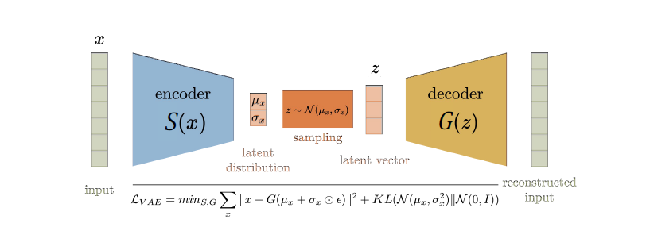

# Effective VAEs

This repository explores the principles and implementation of **Variational Autoencoders (VAEs)**. It serves as a practical guide for understanding VAEs and experimenting with their behavior in latent space, reconstruction, and generation.

## Overview

VAEs are generative models that learn a probabilistic mapping between input data and a latent space, enabling controlled generation of new samples and smooth interpolation between data points.

In this notebook, we focus on:

- Implementing a basic VAE from scratch using PyTorch
- Visualizing the latent space and decoding sampled points
- Comparing training behavior across epochs
- Understanding the role of reconstruction loss and KL divergence

This work is not intended as a homework submission but rather as an educational experiment and applied guide for those wishing to deepen their intuition about VAEs.

## Model Architecture

The following diagram illustrates the architecture of the Variational Autoencoder implemented in this project:



## Features

- Modular VAE implementation
- Support for 2D latent space visualization
- Interpolation and grid sampling in the latent space
- Epoch-wise decoding visualization
- Clean plots with axis labeling and consistent styling

## File Structure

- `vae_experiments.ipynb`: Main notebook with code, training, and visualizations
- `architecture.png`: Illustration of the VAE model architecture
- `generated_images/`: (Optional) Folder to save outputs at different training stages

## Requirements

- Python 3.8+
- PyTorch
- matplotlib
- numpy

You can install dependencies with:

```bash
pip install torch matplotlib numpy
